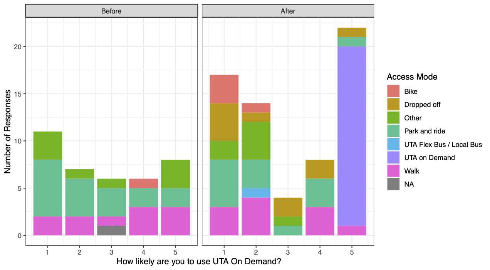

# Results

The surveyors conducted 55 interviews in the first tranche and 75 in the second
tranche; the second tranche consisted of 58 interviews on rail transit platforms
and 17 interviews on the mictrotransit vehicles or at the microtransit pick-up
point adjacent to the rail stations. A summary of the survey respondents in each
tranche is given in Table \ref{tab:survey-respondents}; as outlined in the
Methodology section, the decision to include income level in the survey was made
between the tranches and therefore the “Before” tranche contains no income
information. The number of respondents who declined to answer the other
demographic questions is also relatively high.

\begin{table}[ht]
    \centering
    \caption{Demographic Characteristics of Survey Respondents}
    \label{tab:survey-respondents}
 \renewcommand{\arraystretch}{1.5}
   
\begin{tabular}{@{}lcc@{}}
\toprule
                   & Before (n   = 55) & After (n   = 75) \\ \midrule
\emph{Smartphone}         &                   &                  \\
\quad Yes                & 42                & 48               \\
\quad No                 & 3                 & 2                \\
\quad No Response        & 10 (18.18\%)      & 25 (33.33\%)     \\
\emph{Auto Availability} &                   &                  \\
\quad 0                  & 0                 & 4                \\
\quad 1                  & 18                & 19               \\
\quad 2                  & 13                & 18               \\
\quad 3                  & 8                 & 8                \\
\quad 4+                 & 3                 & 5                \\
\quad No Response        & 13 (23.64\%)      & 21 (28.00\%)     \\
\emph{Income}             &                   &                  \\
\quad Less than \$44,999 & 0                 & 8                \\
\quad \$45,000 - \$99,999  & 0                 & 17               \\
\quad Over \$100k        & 0                 & 17               \\
\quad No Response        & 55 (100.00\%)     & 31 (41.33\%)     \\
\emph{Age}                &                   &                  \\
\quad Under 18           & 0                 & 3                \\
\quad 18-24              & 12                & 8                \\
\quad 25-44              & 24                & 28               \\
\quad 45-64              & 9                 & 10               \\
\quad Over 65            & 0                 & 1                \\
\quad No Response        & 10 (18.18\%)      & 25 (33.33\%)     \\ \bottomrule
\end{tabular}
\end{table}

A primary motivation for the survey was to understand awareness of the
microtransit service among UTA transit riders. In the “Before” tranche, only 6
of the 55 respondents (11\%) stated they had previously heard of the system. Of
the 58 interviews in the “After” tranche not conducted on the microtransit
service, 34 (59\%) had previously heard of the service. This increase in general
awareness of the system indicates both that the UTA marketing efforts were
effective, and also that the responses to the subsequent question of likeliness
to use the service are based in some level of understanding.

Figure \ref{fig:likelihood} shows the reported likelihood of survey respondents
to download the necessary application and use the microtransit service,
separated by access mode. Respondents who were already using the service
selected “5: Extremely Likely.” The first result of this analysis is that there
appears to be a polarization in opinions after the service commenced operations.
Although there are some strong feelings against and for the service in the
“Before” tranche, the neutral opinions have comparatively disappeared in the
“After” tranche. This likely reflects the increasing awareness of the service
discussed above and a hardening of engrained or newly learned habits. It is
important also to stress that the question will not necessarily elicit an
opinion as to whether the service should exist, merely whether the particular
respondent is willing to use it.

The sample is too small to conduct meaningful statistical inference on the role
that access mode plays in these opinions, but some discussion of these
observations is still worthwhile. The apparent turning of bicycle users against
the service is likely statistical noise, though it should also be noted that the
“After” tranche was collected in January and February, when Utah is typically
cold with snow on the ground. Perhaps individuals who are still cycling at those
times will persist in doing so. It is also interesting to note that there
appears to be little overall correlation between access mode and expressed
willingness to use the service, unless the UTA On Demand service attracts people
who would not have used the service otherwise. Of these individuals who
responded to a question about their hypothetical alternative mode, four reported
that they would have used a Transportation Network Company (TNC; e.g. Uber,
Lyft, etc.), two would have used regular UTA services, two would have driven to
the transit station, one would have walked, and one would not have used transit
at all. Additionally, the text responses to the access mode question in the
“before” tranche revealed a number of individuals who used a TNC to access the
system. This supplies anecdotal evidence that microtransit is competing more
against commercial TNC offerings than against conventional transit services.

```{r likelihood, out.width='80%', fig.cap="Reported likelihood of using microtransit by transit access mode."}

```


\begin{figure}
    \centering
    \includegraphics[width = \textwidth]{access_mode.eps}
    \caption{Reported likelihood of using microtransit by transit access mode.}
    \label{fig:likelihood}
\end{figure}

The next consideration is whether the expressed or observed likeliness to use
the microtransit service is related to the demographic characteristics of the
respondents. Noting the low response rate to many of the demographic questions
(see Table \ref{tab:survey-summary}), it is not possible to construct a model
that would predict the likeliness score as a function of these characteristics
in combination. It is still valuable, however, to consider how the observed
distribution of these characteristics differs between individuals who are or are
not likely to use the service. These distributions are shown in Table
\ref{tab:likeliness}, along with the result of a two-sided Fisher exact test of
independence between the indicated characteristic distribution and the
three-category likeliness response. In this test the null hypothesis is that the
two distributions are independent with the alternative being there is some
dependence between the characteristic and the response. A $p$-value less than a
given critical threshold indicates that the null hypothesis has a low
probability and should be rejected. A conventional value of the critical value
is $\alpha=0.05$, though given the small sample sizes in this survey other
critical values may be suggestive of the need for future evaluation.

\begin{table}[ht]
    \centering
     \renewcommand{\arraystretch}{1.5}
    \caption{Distribution of Rider Characteristics by Reported Likeliness}
    \label{tab:likeliness}
\begin{tabular}{@{}lccc@{}}
\toprule
                   & Not Likely (1 and 2) & Neutral (3) & Likely (4 and 5) \\
\midrule
\multicolumn{4}{l}{\emph{Smartphone} ($p_F = 0.563$ on 2 degrees of freedom)}\\
\quad Yes                & 41 (95\%)            & 8 (89\%)    & 30 (97\%)        \\
\quad No                 & 2 (5\%)              & 1 (11\%)    & 1 (3\%)          \\
\multicolumn{4}{l}{\emph{Household Size} ($p_F = 0.207$ on 6 degrees of freedom)}\\
\quad 1                  & 2 (7\%)              & 0 (0\%)     & 2 (14\%)         \\
\quad 2                  & 8 (29\%)             & 0 (0\%)     & 1 (7\%)          \\
\quad 3                  & 4 (14\%)             & 1 (25\%)    & 0 (0\%)          \\
\quad 4+                 & 14 (50\%)            & 3 (75\%)    & 11 (79\%)        \\
\multicolumn{4}{l}{\emph{Auto Availability} ($p_F = 0.659$ on 8 degrees of freedom)}\\
\quad 0                  & 1 (2\%)              & 0 (0\%)     & 3 (10\%)         \\
\quad 1                  & 22 (49\%)            & 3 (33\%)    & 10 (33\%)        \\
\quad 2                  & 12 (27\%)            & 3 (33\%)    & 9 (30\%)         \\
\quad 3                  & 7 (16\%)             & 1 (11\%)    & 5 (17\%)         \\
\quad 4+                 & 3 (7\%)              & 2 (22\%)    & 3 (10\%)         \\
\multicolumn{4}{l}{\emph{Income} ($p_F = 0.687$ on 4 degrees of freedom)}\\
\quad Less than \$44,999 & 4 (17\%)             & 1 (33\%)    & 3 (21\%)         \\
\quad $45,000 - $99,999  & 10 (44\%)            & 2 (67\%)    & 5 (36\%)         \\
\quad Over \$100k        & 9 (39\%)             & 0 (0\%)     & 6 (43\%)         \\
\quad Under 18           & 1 (2\%)              & 2 (20\%)    & 0 (0\%)          \\
\multicolumn{4}{l}{\emph{Age} ($p_F = 0.00364^*$ on 8 degrees of freedom)}\\
\quad 18-24              & 7 (16\%)             & 2 (20\%)    & 9 (31\%)         \\
\quad 25-44              & 28 (64\%)            & 1 (10\%)    & 17 (59\%)        \\
\quad 45-64              & 7 (16\%)             & 5 (50\%)    & 3 (10\%)         \\
\quad Over 65            & 1 (2\%)              & 0 (0\%)     & 0 (0\%)         \\
\bottomrule
\multicolumn{4}{l}{$^*$ indicates $p$-value less than 0.05}

\end{tabular}
\end{table}


Smartphone use appears to not be a contributing factor in the likeliness of using microtransit, as almost all respondents use a smartphone regardless of their reported likeliness. We also fail to reject the null hypothesis of independence between the likeliness to use microtransit and both auto availability and household income. The joint distribution of reported likeliness and household size suggests there could be some dependence, with members of smaller households more frequently expressing reluctance to use microtransit. This finding, if it could be verified, would be somewhat counter to the \emph{a priori} expectations of UTA. A Fisher test of independence between these household size and expressed likeliness still fails to conclusively reject the null hypothesis but given the small sample size and counter-intuitive results, future investigation is warranted. This is particularly true given that automobile availability and household size go hand-in-hand: a household with more individuals, particularly driving-age individuals, will be more constrained in their driving behavior even with multiple household automobiles. Considering these two variables together will be important for future research but cannot be attempted here.

A clear statistical result is shown, however, between the reported willingness to use microtransit and the age of the respondent. This significant result persists when we recombine the age categories as well as discard neutral responses. Table \ref{tab:age-difference} shows the differences between the observed values in the joint distribution of these two variables and the expected values based on the marginal distributions were the two variables to be completely independent. The largest differences occur in three noticeable places. First, individuals in the 18-24 years old category are more likely to express willingness to use microtransit. Second, individuals between 45 and 64 are more likely to express a neutral opinion than a positive or strictly unlikely one. Finally, individuals between 25 and 44 are – perhaps surprisingly – substantially more likely to express a negative opinion than a neutral one; these individuals are also modestly more likely than expected to express positive willingness to use transit. 

\begin{table}[ht]
    \centering
         \renewcommand{\arraystretch}{1.5}
    \caption{Difference of Observed and Expected Frequencies for Age and Likeliness}
    \label{tab:age-difference}
    \begin{tabular}{@{}lccc@{}}
\toprule
Age      & Not Likely & Neutral & Likely \\
\midrule
Under 18 & – 0.59     & 1.64    & – 1.05 \\
18-24    & – 2.54     & – 0.17  & 2.71   \\
25-44    & 3.61       & – 4.54  & 0.93   \\
45-64    & –0.95      & 3.19    & – 2.24 \\
Over 65  & 0.47       & – 0.12  & – 0.35\\
\bottomrule
\end{tabular}
\end{table}